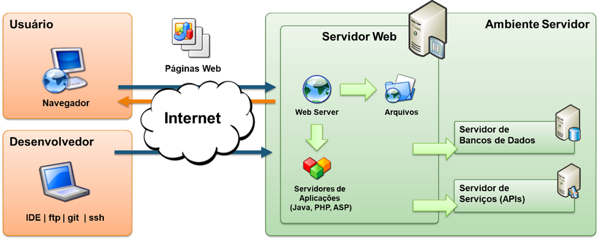
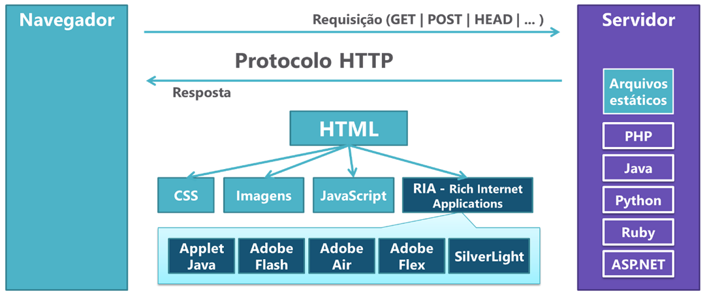
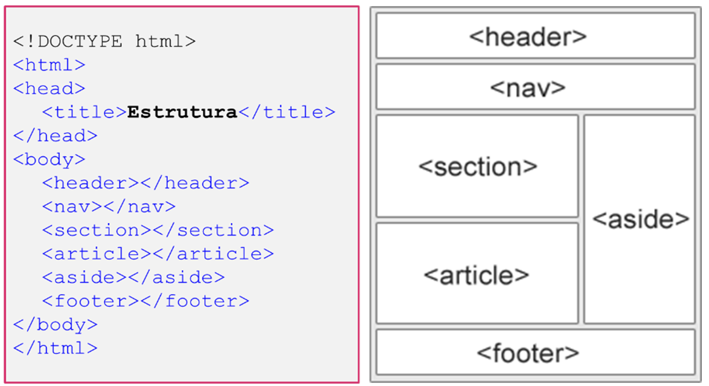
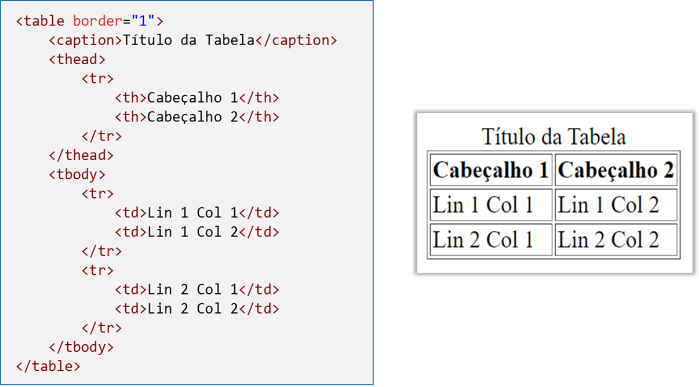
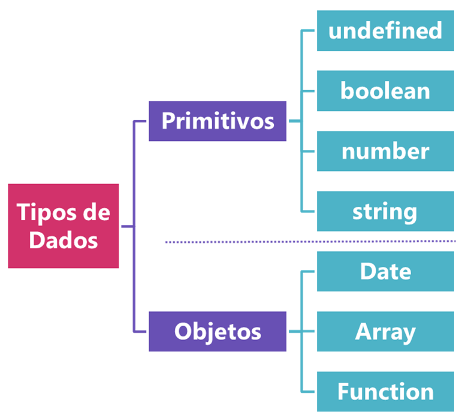
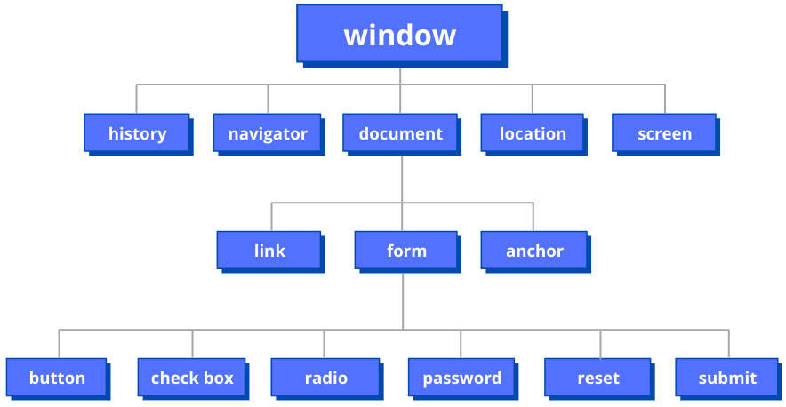

# Notas Desenvolvimento Web Front-end (PUC Minas)
<!--ts-->
- [Os padrões da web](#os-padrões-da-web)
    - [Documentação do W3C](#documentação-do-w3c)
- [Arquitetura Web](#arquitetura-web)
    - [Modelo Cliente-Servidor](#modelo-cliente-servidor)
    - [Internet](#internet)
    - [Protocolo HTTP](#protocolo-http)
    - [URI](#uri)
    - [URL](#url)
    - [URN](#urn)
    - [Servidores Web](#servidores-web)
        - [Funções do web server](#funções-do-servidor-web)
- [HTML](#html)
    - [HTML e CSS - associando](#html-e-css---associando)
    - [Estrutura do documento - Cabeçalho](#estrutura-do-documento---cabeçalho)
    - [Listas](#listas)
    - [Imagem](#imagem)
    - [Link](#link)
    - [Elementos estruturais](#elementos-estruturais)
    - [Tabelas](#tabelas)
    - [Formulários](#formulários)
        - [Elemento textarea](#elemento-textarea)
        - [Elemento select](#elemento-select)
- [CSS](#css)
- [JavaScript](#javascript)
    - [Variáveis e constantes](#variáveis-e-constantes)
    - [Estruturas e Tipos de Dados](#estruturas-e-tipos-de-dados)
        - [Number](#number)
        - [Boolean](#boolean)
        - [String](#string)
        - [Objetos](#objetos)
            - [Data](#data)
            - [Arreys, vetores ou matrizes](#arreys-vetores-ou-matrizes)
    - [Controle de Fluxo](#controle-de-fluxo)
        - [Declaração de seleção](#declaração-de-seleção)
        - [Declaração de repetição](#declaração-de-repetição)
    - [Funções](#funções)
    - [Modelo de Objetos (DOM)](#modelo-de-objetos-dom)

<!--te-->

***
## WWW - World Wide Web
>Sistema de informação interligado por hipertexto.

- [What is Web 2.0 - O'Reily Media, 2005](https://www.oreilly.com/pub/a/web2/archive/what-is-web-20.html)

# Os padrões da web

Entre os padrões mantidos pelo [W3C](https://www.w3.org/standards/), podemos citar:

- Design e Aplicações Web (HTML, CSS, SVG, Ajax, Acessibilidade);
- Arquitetura da Web (Protocolo HTTP, URI);
- Web Semântica (Linked Data - RDF, OWL, SPARQL);
- Web Services (SOAP, WSDL);
- Tecnologia XML (XML, XML Schema, XSLT);
- Navegadores e ferramentas de autoria.

## Documentação do W3C

O W3C estabelece um processo rigoroso para a manutenção dos padrões mantidos pela organização. Um padrão passa pelos seguintes estágios antes de ser liberado formalmente para o mercado:

- Working Draft (WD);
- Candidate Release (CR);
- Proposed Recomendation (PR);
- Recomendation (REC).

# Arquitetura Web

## Modelo Cliente-Servidor

- Cliente requisita por meio `URI`;
- Servido corresponde por meio do protocolo `HTTP`.

## Internet

É uma rede mundial de computadores baseada no protocolo TCP/IP, em que todo computador conectado é denominado host (hospedeiro) e possui um identificador endereço `IP` (Internet Protocol) no padrão A.B.C.D (ex: 200.20.15.22). `DNS` troca os números para um nome legível pelo usuário (ex: www.google.com).

A `URL` (Uniform Resource Locator), é um texto codificado que traz todos os detalhes sobre o recurso solicitado pelo ambiente cliente. A URL, é um tipo de `URI` (Uniform Resorce Identifier), padrão utilizado na Internet para referenciar recursos dos mais diversos tipos como páginas, imagens, vídeos, até pessoas, produtos e outras entidades. A URI, seja uma URL ou uma URN, funciona tal qual o CPF para pessoas.

## Protocolo HTTP

`HTTP` é a forma como clientes e servidores se comunicam na rede. As requisições e as respostas obedecem aos padrões estabelecidos pelo protocolo HTTP.

A requisição `HTTP` é um pacote de dados enviado através da Internet pelo Cliente Web para o Servidor Web e identifica o recurso solicitado e como ele deve ser entregue. A resposta `HTTP` é formada por pacotes de dados enviados pelo `Servidor Web` para o `Cliente Web` com o recurso solicitado.

Esse processo são conduzidos os seguintes passos:

- Usuário informa a URL pelo cliente. Ex.: http://www.exemplo.com.br.
- O cliente monta uma requisição HTTP e encaminha ao servidor.
- O servidor recebe a requisição, processa e envia uma resposta ao cliente.
- A resposta é recebida e interpretada pelo cliente, o resultado é exibido para o usuário.

Para páginas HTML, novas requisições são feitas para outros objetos que podem ser necessários para a apresentação adequada da página como imagens, arquivos JavaScript, arquivos CSS, entre outros.
Dessa forma, podemos descrever o protocolo HTTP como um conjunto de regras que definem como as requisições e as respostas devem ser montadas de tal forma que o servidor possa entender o que o cliente está requisitando e como e, também, o cliente possa entender aquilo que é devolvido pelo servidor.

>[HTTP - Mozilla.org](https://developer.mozilla.org/pt-BR/docs/Web/HTTP)

>[RCF 2616 - Hypertext Transfer Protocol - HTTP/1.1](https://www.rfc-editor.org/rfc/rfc2616)

## URI

`URI` (Uniform Resource Identifier) é um padrão para o endereçamento de recursos disponíveis na rede que engloba os conceitos de `URL` (Uniform Resource Locator) e `URN` (Uniform Resource Name).

## URL

O URL (Uniform Resource Locator) é um padrão de URI que serve para referenciar um recurso e sua localização, normalmente na Internet. O URL é composto pelas seguintes partes:

- Esquema – identifica a forma de interação entre um cliente e um servidor, como por exemplo, http, https, ftp, entre outros;
- User:pass – informações de usuário;
- Host – nome ou número IP onde se encontra a aplicação servidor;
- Porta – identifica a porta TCP/IP associada ao servidor. A porta padrão do HTTP (80) pode ser omitida;
- Caminho – indica o local exato onde o recurso se encontra;
- Query – dados não hierárquicos, detalhando a consulta normalmente sob a forma de pares nome e valor;
- Fragmento – identifica uma seção no recurso.

## URN

O `URN` (Uniform Resource Name) é um tipo de `URI` que identifica um recurso específico (NSS) pelo nome em um namespace (NID), sem expressar a sua localização. No exemplo “urn:isbn:978-1-491-91866-1”, utilizamos a `URN` para identificar um livro a partir do seu código de ISBN, sem dizer onde esse livro está localizado.


>[Identificando recursos da web - Mozilla.org](https://developer.mozilla.org/pt-BR/docs/Web/HTTP/Basics_of_HTTP/Identifying_resources_on_the_Web)

## Servidores Web

Um site da Internet tem seus arquivos e todas as demais informações mantidas em um ambiente servidor que é responsável, em primeira instância, por servir essas informações para os usuários que requisitam o referido site. O ambiente servidor pode ser composto por várias peças, mas a principal delas é um software ou programa denominado Servidor Web. Este software é o responsável por processar a requisição feita por um cliente Web (navegador da Internet ou outra aplicação qualquer) e prover os recursos solicitados. A imagem a seguir apresenta em mais detalhes a arquitetura da Web com foco no ambiente Servidor.



### Funções do Servidor web

- Atender requisições HTTP e processar repostas.
- Gerenciar múltiplos sites (Domínios, IPs e Portas).
- Gerenciar arquivos dos sites (File System).
- Integrar com mecanismos de scripts: PHP, PERL, ASPX, Ruby, Python, etc.
    - Autenticação básica ou digest (Protocolo HTTP)
    - Integração com servidores de autenticação (Microsoft Active Directory, LDAP Servers, Radius Servers)
- Implementar a criptografia na comunicação: HTTPS - TLS/SSL.
- Cache de recursos.
- Auditoria (Logs de acesso, sistema e erros).

>[O que é um servidor web (web server) - Mozilla.org](https://developer.mozilla.org/pt-BR/docs/Learn/Common_questions/What_is_a_web_server)

***
# HTML




## Estrutura de um documento HTML
```html
<!DOCTYPE html>
<html>
    <head>
        <meta name="author" content ="name"> <!--contém atributos-->
    </head>
    <body>
        <h1> título </h1>
        <p> parágrafo </p>
    </body>
</html>
```

- Elementos: `<tag>` conteúdo `</tag>` | tag de abertura e tag de fechamento

- Atributos: `nome`=`"valor"`

>O `DOCTYPE` indica ao browser qual a versão do HTML está sendo utilizada no documento, alternando entre `quirks mode` e `strict mode`
- HTML5
    - `<!DOCTYPE html>`
- HTML 4.01
    - `<!DOCTYPE HTML PUBLIC "-//W3C//DTD HTML 4.01 Transitional//EN">`
- HTML 1.0
    - `<!DOCTYPE html PUBLIC "-//W3C//DTD XHTML 1.0 Transitional//EN"
"http://www.w3.org/TR/xhtml1/DTD/xhtml1-transitional.dtd">`

## HTML e CSS - associando

- HTML

```html
...
<h1 id="titulo1" class="noticias">
    Título
</h1>
```
- CSS

```css
/* pelo nome do elemento */
h1 {
    color: red;
}
/* pelo ID do elemento*/
#titulo1 {
    font-size: 33px;
}
/* pela classe do elemento*/
.noticias {
    font-family: arial;
}
```

## Estrutura do documento - CABEÇALHO

- Representada pela tag `<head>`, que inclui os metadados, referências, estilos...

```html
<!DOCTYPE html>
<html lang="pt-br">
    <head> <!-- Cabeçalho -->
        <title>Exemplo</title>
        <meta charset="UTF-8">
        <meta name="author" content ="Geraldo Homero">
        <meta name="descripton" content="teste e exemplo de HTML">
        <meta name="keywords" content="palavra-chave, html, web, css">
        <link rel="stylesheet" href="./style.css">
        ...
        ...
        ...
    </head> <!-- Fim do Cabeçalho -->
    <body>...</body>
</html>
```

|Elementos|Tags|
|---------|----|
|Títulos| `<h1>` .. `</h1>`, `<h2>` .. `</h2>`, ... , `<h6>` ...`</h6>`|
|Paragráfos|`<p>` .. `</p>`|
|Quebra de linha| `<br>`|
|Voz alternativa (itálico)| `<i>` .. `</i>`|
|Palavra-chave (negrito)| `<b>` .. `</b>`|
|Importância|`<strong>` .. `</strong>`|
|Código fonte|`<code>` ... `</code>`|
|Texto pré-formatado| `<pre>` .. `</pre>`|
|Citações|`<blockquote>` .. `</blockquote>`|

## Listas
### Ordenada `(<ol> .. </ol>)`, não ordenada `(<ul> .. </ul)` e definições `(<dl> .. </dl>)`. 

```html
...
<ol> 
  <li> primeiro item</li>
  <li> segundo item</li>
  <li> terceiro item</li>
</ol>
...

```
>As listas de definições apresentam os itens e suas definições indentadas. Essas listas possuem elementos específicos para os termos `(<dt> .. </dt>)` e para as suas definições `(<dd> .. </dd>)`, conforme mostrado no exemplo a seguir. 

```html
...
<dl> 
  <dt> termo 01</dt>
  <dd> definição 01</dd>
  <dt> termo 02</dt>
  <dd> definição 02</dd>
</dl>
...
```

## Imagem

```html
   
```

## Link

```html
  <a href="http://linkexemplo.com" target="_blank"> Texto link exemplo </a>
```
>O atributo `target` define onde o documento apontado pelo link será aberto e aceita os valores:  

- `_blank` – para nova janela ou tab,
- `_self` – para a mesma janela – default,
- `_parent` – para a o frame pai,
- `_top` – para a janela atual inteira ou
- `nome_do_frame` – para um frame específico.

>[Free guide to HTML - htmlreference.io](https://htmlreference.io/)

>[HTML: HyperText Markup Language - Mozilla.org](https://developer.mozilla.org/en-US/docs/Web/HTML)

## Elementos estruturais

Com o HTML 5, foram criados vários elementos novos com significados específicos, porém com a mesma funcionalidade do elemento `<div>`, ou seja, agrupar outros elementos de uma página. Esses elementos, muitas vezes denominados `elementos semânticos`, trouxeram uma gama de possibilidades para o desenvolvedor. 

|Elementos|	Descrição|
|--------|-----------|
|`<article>`|	Define um artigo.|
|`<aside>`	|Define conteúdo além do conteúdo da página.|
|`<details>`|	Define detalhes adicionais que o usuário pode visualizar ou ocultar.|
|`<figcaption`>|	Define o título para um elemento `<figure>`.|
|`<figure>`|	Define um elemento autocontido como ilustração, diagramas, fotos, listagem de código etc.|
|`<footer>`|	Define um rodapé para o documento ou seção.|
|`<header>`	|Especifica o cabeçalho para um documento ou seção.|
|`<main>`|Especifica o conteúdo principal de um documento.|
|`<mark>	`|Define texto destacado.|
|`<nav>`	|Define conteúdo de navegação.|
|`<section>`|	Define uma seção em um documento.|
|`<summary>`|	Define um resumo visível para um elemento `<details>`.|
|`<time>`|Define uma data/hora.|



>[Semantic in HTML](https://htmlreference.io/semantic/)

>[Document and website structure - Mozilla.org](https://developer.mozilla.org/en-US/docs/Learn/HTML/Introduction_to_HTML/Document_and_website_structure)

## Tabelas

|Elementos|	Descrição|
|---------|----------|
|`<table>`|	Elemento que compreende toda a tabela.|
|`<caption>`|	Define o título da tabela.|
|`<thead>`|	Agrupa as linhas de cabeçalho da tabela.|
|`<tbody>`|	Agrupa as linhas de dados da tabela.|
|`<tfoot>`|	Agrupa as linhas de rodapé da tabela.|
|`<tr>`|	Define uma linha da tabela.|
|`<th>`|	Define uma célula do cabeçalho dentro de uma tag `<tr>`.|
|`<td>`|	Define uma célula de dados dentro de uma tag `<tr>`.|


[HTML - Tabela](./src/html/estrutura-tabela.html)

## Formulários

- `name` e `id` identificam o formulário no contexto da página;
- `action` indica qual a URL a ser disparada para processamento do formulário;
- `method` indica como o formulário será submetido via requisição HTTP (POST ou GET).

```html
<form name="form_login" action="_do_login.html" method="POST">
    Usuário: <input type="text" name="usuário" value=""><br>
    Senha: <input type="password" name="senha" value=""><br>
    <input type="submit" value="Ok">
</form>
```
>[Código de exemplo](./src/html/form-simples.html)

>[Código de exemplo - Formulário](./src/html/form-completo.html)

`<input>` é  elemento mais comum nos formulários. Este elemento define campos ou entradas de dados e possui os seguintes atributos:

- O atributo `type` identifica o tipo do campo: text, number, password, email, date, submit, radio, checkbox;
- O atributo `name` identifica o campo do formulário;
- O atributo `value` trata o valor contido no campo;
- O atributo `placeholder` permite incluir um valor de exemplo apresentado pelo Navegador quando o campo estiver vazio;
- O atributo `required` permite a validação automática de um campo evitando que o usuário submeta o formulário com o campo vazio;
- O atributo `disabled` inativa o campo e não permite ao usuário interagir, apenas visualizar o valor definido no código HTML.

### Elemento `textarea` 
permite a entrada de texto livre e com várias linhas. O atributo `rows` e `cols` definem o número de linhas e colunas para a apresentação do controle pelo Navegador.  

```html
<form action="demo.html" method="POST">
    Texto <br>
    <textarea name="texto" rows="10" cols="50">
    Preencha com algum texto
    </textarea>
</form>
```

### Elemento `select`
```html
<label for="fruta">Frutas: </label>
<select name="fruta">
    <option value ="">Selecione uma Fruta</option>
    <option value =abacaxi"">Abacaxi</option>
    <option value ="abacate">Ameixa</option>
    <option value="uva">Uva</option>
</select>
```
>O atributo `multiple` define se é possível selecionar mais de uma opção. No caso de múltiplas opções, é possível definir com o atributo `size` o tamanho da caixa aberta. 

>[Web forms - Mozilla.org](https://developer.mozilla.org/en-US/docs/Learn/Forms)

# CSS

# JavaScript
- Três formas de incluir código JavaScript em uma página web:

    - Arquivos JavaScript externos – uma referência para um arquivo adicional contendo o código a partir de um elemento script;
    - Blocos Internos – Código inserido dentro de um elemento script na página Web;
    - Código Inline – porção de código inserido em atributos vinculados a eventos dos elementos da linguagem HTML.

```html
<!DOCTYPE html> 
<html> 
   <head> 
     <title> Exemplo Javascript </title> 
     <!-- Usando arquivo Js externo. -->
     <script type="text/javascript"  src="script.js"> </script>

     <!-- Usando bloco interno.-->
     <script type="text/javascript">
        /* código Javascript */
        alert('Passei por aqui!');
     </script> 
   </head>     
     
     <!-- Usando código inline. -->
     <body> 
        <p  onClick="alert('Você clicou no parágrafo');"> ... </p> 
     </body> 
</html>
```
>JavaScript é uma linguagem `case sensitive`, portanto, `Nome` é diferente de `NOME` que é diferente de `nome`.

## Variáveis e Constantes

- `var`

>>Variável de atuação dentro do escopo global

- `let`

>>Variável de atuação dentro do escopo local

`Isso é utilizado quando queremos limitar a área em que uma variável é manipulada`
```js
var resultado;         // Declaração com var sem atribuição.
var x = 0;             // Declaração com var e com atribuição.
let y = "Hello World"; // Declaração com let e com atribuição.
```

- `const`

>> `const x = 3.14`

>>Diferentemente das variáveis (que podem receber outros valores no decorrer do código), as constantes `não` podem ter seus valores `alterados`. 

## Estruturas e tipos de dados:

 

### Number

>Os valores numéricos, sejam inteiros ou fracionários, são tratados no JavaScript pelo tipo number e armazenados no formato de ponto flutuante com tamanho de 64 bits.

### Boolean

>Os valores lógicos `true` (verdadeiro) e `false` (falso) fazem parte do tipo booleano.

|Operador	|Exemplo|	Resultado|
|:----:|:------:|:------:|
|Igual a|	x == y	|true se x e y são iguais|
|Igual e mesmo tipo|	x === y	|true se x e y são iguais e do mesmo tipo|
|Não igual a|	x !== y	|true se x e y são diferentes|
|Maior que	|x > y	|true se x é maior que y|
|Menor que|	x < y	|true se x é menor que y|
|Maior ou igual a| 	x >= y	|true se x é maior ou igual a y|
|Menor ou igual a|	x <= y	|true se x é menor ou igual a y|
|Negativo	|!x	|true se x é false|
|E exclusivo (ambos true)	|x && y	|true se x e y são true|
|Ou (pelo menos um true)|	x // y|	true se ou x ou y são true|

### String

- Sequência de caracteres Unicode - Além de o operador `+` poder ser usado para conectar `strings`

- A barra invertida `\` é utilizada para tratar caracteres especiais:

|Código|	Significado|
|---|----|
|`\0`	|Caracter NULL|
|`\'`|	Aspas simples|
|`\"`|	Aspas duplas|
|`\\`|	Barra invertida|
|`\n`	|Nova linha (ENTER)|
|`\r`	|Retorno de Carro (CR)|
|`\v`	|Tabulação vertical|
|`\t`	|Tabulação|
|`\b`	|Backspace|
|`\f`	|form feed|
|`\uXXXX`|	Caracter Unicode|
|`\xXX`|	Caracter Latin-1|

```html
<script>
var a = "Exemplo\nHello \'World\'";
console.log (a);
</script>
```

>A partir do [ES 6](https://www.w3schools.com/js/js_es6.asp), é possível definir `strings` também com o caractere ` ` ` **(crase)** e isso define uma Template String que permite o uso de expressões interpretáveis dentro do texto.

```js
// Criação básica de uma string
let s1 = 'Em JavaScript '\n' significa é uma nova linha.'

// Strings de várias linhas
let s2 = 'Nas strings normais, não é possível
descrever texto em várias linhas'  

// Interpolação de expressões dentro de strings
var nome = "Geraldo", tempo = "hoje";
let s3 = 'Olá ${nome}, como está você ${tempo}?'  

console.log('${s1} \n${s2} \n${s3}');
```

- Além disso, strings definidas via ` ` ` (crase) podem interpretar expressões via construção.
- `${ expressão }`:

```js
var a = 5;
var b = 10;
console.log (`a + b = ${a + b} e \n
              a * b = ${a * b}. `);
```

- Conversão de `string` em número
    - `parseInt ();`
    - `parseFloat ();`

- Conversão de número para `string`
    - Automática

```js
var a = parse.Int ("256");
console.log (a);
var a = parseInt ("2.56");
console.log (a);
var a = parseFloat ("2.56");
console.log (a);
var a = "Valor: " + 2.56;
console.log (a);
```
**Saída:**

256

2

2.56

Valor: 2.56

### Objetos

>Em JavaScript, os objetos são coleções de pares nome e valor, em que o nome é uma string e o valor pode ser de qualquer outro tipo, incluindo outros objetos. Os objetos são dinâmicos e podem receber novas propriedades e métodos a qualquer momento.

```js
  var o = new Object();
  o.name = "João"; //Objeto "o" passa a ter um atributo do tipo string que tem o nome "name"
  o["age"] = 16;
  console.log (o.name + "-" + o.age);

  //Forma de Notação de Objetos (JSON):
  var email = {    //as { indicam a criação de um objeto.
    mensagem: "Olá Pamela",
    detalhes: {    //novo objeto
      para: "Pamela",
      de: "João"
  }
 };
 console.log (email.mensagem);
```

>Os `objetos` são dinâmicos e podem receber novas propriedades e métodos a qualquer momento

>>>`JSON` (**J**ava**S**cript **O**bject **N**otation) é a forma como se descrevem os objetos em `js`

### Data

>As datas em JavaScript são objetos que armazenam as informações de data e hora. Para se criar um Objeto existem diversos construtores possíveis no JavaScript, são eles:

- Date ()
- Date (milissegundos)
- Date (string)
- Date (Ano, Mês, Dia, Hora, Minuto, segundos, milissegundos)

```js
var a = new Date(); //sem parâmetros: data corrente
console.log (a.toLocaleString()); //formatação LOCAL da data
var a = new Date(2016, 0, 31); //Zero "0" significa janeiro e "11" dezembro
console.log (a.toLocaleString()); //formatação LOCAL da data 
```

### Arreys, vetores ou matrizes

Os arrays, vetores ou, ainda, matrizes também são tratados no JavaScript como objetos. A criação de um array pode ser feita por meio do construtor Array () com valores de inicialização dos elementos ou por meio da atribuição direta de um array representado por colchetes [ .. ] e os elementos separados por vírgulas. 

```js
var a = new Array();
a[0] = "vermelho";
a[1] = "preto";
console.log (a); 

var b = new Array("rosa", "azul");
console.log (b); 

var c = ["amarelo", "verde"];
console.log (c);
console.log (c.length);

//   Saída:
//   ["vermelho", "preto"]
//   ["rosa", "azul"]
//   ["amarelo", "verde"]
//   2
```

>Nos arrays, a propriedade `length` permite verificar o número de itens mantidos dentro do array.

|Método	|Descrição|
|----|-----|
|concat()|	Junta dois ou mais vetores e retorna uma cópia dos vetores assoriados
|fill()|	Preencher os elementos em um vetor com um valor estático
|find()|	Retorna o valor do primeiro elemento em um vetor que atender ao filtro
|findIndex()|	Retorna o índice do primeiro elemento em um vetor que atender ao filtro
|forEach()|	Chama uma função para cada elemento do vetor
|indexOf()|	Busca um elemento no vetor e retorna a sua posição
|isArray()|	Verifica se um objeto é um vetor
|join()|	Junta todos os elementos de um vetor em uma string
|lastIndexOf()|	Pesquisar o vetor por um elemento, começando no final e retorna a sua posição
|pop()|	Remove o último elemento de um vetor e retorna o elemento
|push()|	Adiciona novos elementos para o final de um vetor e retorna o novo comprimento
|reverse()|	Inverte a ordem dos elementos em um vetor
|slice()|	Seleciona uma parte de um vetor e retorna o novo vetor
|sort()	|Classifica os elementos de um vetor
|splice()|	Adiciona/remove elementos de um vetor
|toString()|	Converte um vetor em uma string e retorna o resultado
|valueOf()|	Retorna o valor primitivo de um vetor

## Controle de Fluxo


### Declaração de seleção

-`if` e `else`

```js
if (expressão) { 
   comandos_true 
} 
else { 
   comandos_false 
}
```

```js
if (nota > 60) {
alert ('O aluno foi aprovado.');
}
else {
alert ('O aluno foi reprovado.');
}
```

### Declaração de repetição

- `while`
```js
while (condicao) { 
   comando da repetição;
} 
```

```js
alert ('Iniciando a contagem regressiva.');

// Declare uma variável para servir de contador
var i = 3;

// Inicie a contagem regressiva avaliando o contador
while (i > 0) {
      alert ('Contagem: ' + i );

      // Diminui o contador em 1
      i--;
}
```
- `for`
```js
for (inicializacao; condicao; alteracao) {
    comando da repeticao;
}
```

### Exemplo

```js
var avaliacoes = ["PROVA 1", "PROVA 2", "TRABALHO FINAL"]
var cont = 0;

var notaAluno= [35, 20, 0.3];
var somaAluno = 0;

for (let x = 0; x < avaliacoes.length; x++) {
    console.log(`A nota para a ${avaliacoes[x]} foi ${notaAluno[x]}`);
    //soma = soma + notaAluno[x];
    somaAluno += notaAluno[x];
}

if (somaAluno >= 60) {
    console.log (`Aluno APROVADO! Nota final foi de ${somaAluno}`);
}
else {
    console.log (`Aluno REPROVADO! Nota final foi de ${somaAluno}`);
}
```
[Exemplo JavaScript](./src/js/avaliacoes-notas.js)

>[Controle de Fluxo e manipulação de erro - Mozilla.org](https://developer.mozilla.org/pt-BR/docs/Web/JavaScript/Guide/Control_flow_and_error_handling)

## Funções

- Exemplo anterior usando função
```js
var avaliacoes = ["PROVA 1", "PROVA 2", "TRABALHO FINAL"]
var cont = 0;

var notaAluno= [35, 20, 0.3];
function avaliaAluno () {
    var somaAluno = 0;

    for (let x = 0; x < avaliacoes.length; x++) {
        console.log(`A nota para a ${avaliacoes[x]} foi ${notaAluno[x]}`);
        //soma = soma + notaAluno[x];
        somaAluno += notaAluno[x];
    }

    if (somaAluno >= 60) {
        console.log (`Aluno APROVADO! Nota final foi de ${somaAluno}`);
    }
    else {
        console.log (`Aluno REPROVADO! Nota final foi de ${somaAluno}`);
    }
}
```

## Modelo de Objetos (DOM)

O Document Object Model (DOM) é uma API orientada a objetos criada para permitir a manipulação de estruturas do navegador e da página Web (conteúdo, estrutura e estilos). O DOM é um padrão W3C, independente de plataforma e linguagem

A relação a seguir apresenta o significado de cada um dos principais elementos disponíveis por meio do DOM:

- window – representa a janela do navegador
- navigator – contém informações sobre o navegador
- screen – contém informações sobre a tela do cliente
- history – contém os sites visitados
- location – contém informações sobre a URL atual
- document – representa um documento HTML e pode ser usado para acessar todos os outros elementos
- Outros – cada elemento da linguagem HTML possui um objeto associado que pode ser utilizado para montar a dinâmica das páginas Web, são eles: anchor, area, base, body, button, event, form, frame, frameset, iframe, image, input button, input checkbox, input file, input hidden, input password, input radio, input reset, input submit, input text, link, meta, object, option, select, style, table, tablecell, tablerow, textarea.



### Objeto `window`

Para gerenciar o armazenamento de dados no Navegador, o objeto window fornece dois repositórios: o localStorage e o sessionStorage. O repositório localStorage permite que os dados sejam mantidos, mesmo que o Navegador seja fechado. 

```js
sessionStorage.setItem ('login', 'nomedeusuario');
alert ('O usuário logado é: '+ sessionStorage.getItem ('login'));
```

Para programar algumas ações de acordo com o tempo, objeto window fornece alguns métodos muito úteis ao desenvolvedor Web:

- `setInterval (função, intervalo)` – informa o Navegador para executar uma função continuamente a cada intervalo, medido em milissegundos;
- `clearInterval ()` – cancela a repetição da função;
- `setTimeout (função, intervalo)` – agenda uma função no Navegador para ser executada depois de um intervalo em milissegundos.
- `clearTimeout ()` – cancela o agendamento.
 
 ### Objeto `document`

 |Propriedade|Descrição|
 |----|------|
|addEventListener ()|	Associa uma função de tratamento a um dos eventos do documento|
|baseURI|	Retorna a URI base para o documento|
|body|	Obtém ou altera o elemento `<body>` do documento|
|cookie|	Retorna todos os cookies definidos pelo documento|
|characterSet|	Retorna a codificação de caracteres do documento|
|documentElement|	Retorna o elemento `<html>` do documento|
|documentURI|	Obtém ou altera a URI do documento|
|forms|	Retorna uma coleção (array) com os formulários do documento|
|getElementById ()|	Retorna o elemento que possui o ID passado como argumento|
|getElementsByClassName ()|	Retorna uma coleção (array) de elementos com todos aqueles que possuem a classe passada como argumento|
|getElementsByName ()|	Retorna uma coleção (array) de elementos com o nome passado como argumento|
|getElementsByTagName ()|	Retorna uma coleção (array) de elementos cuja tag é igual ao argumento passado
|images|	Retorna uma coleção (array) com as imagens do documento 
|lastModified|	Retorna a data e hora de modificação do documento
|links|	Retorna uma coleção (array) de elementos que possuem o atributo href (<a>) 
|querySelector ()|	Retorna o primeiro elemento do documento selecionado pelo seletor CSS passado como argumento
|querySelectorAll ()|	Retorna uma coleção (array) com todos os elementos do documento selecionados pelo seletor CSS passado como argumento
|removeEventListener()|	Desassocia a função de tratamento do evento do documento
|scripts|	Retorna uma coleção (array) de scripts associados ao documento
|title|	Obtém e altera o título do documento
|URL|	Retorna a URL complete do documento carregado

[HTML DOM Documents - W3Schools](https://www.w3schools.com/jsref/dom_obj_document.asp)

- Exemplo:
```html
<!DOCTYPE html>
<html>

<head>
         <title>Laboratório Javascript</title>
         <script type="text/javascript">
                function Executar() {
                       document.getElementById('saida').innerHTML = Date();
                 }
        </script> <!-- Sempre bom o JavaScript vir separado do HTML !-->
</head>

<body>
       <button type="button" onclick="Executar ();">Disparar</button>
       <h1>Saída</h1>
       <div id="saida"></div>
</body>

</html>
```

### Eventos

>>O DOM define para cada elemento da Linguagem HTML um conjunto de eventos controlados pelo Navegador que nos permite criar pontos de disparo de código para montar a dinâmica da página em questão.

|Evento|	Quando ocorre...|	Controle|
|---|---|---|
|click	|Usuário clica no link ou element de formulário|	onclick
|change|	Usuário altera o valor de elemento de texto, textarea ou seleção	|onchange
|focus|	Usuário posiciona o foco em um element de formulário	|onfocus
|blur|	Usuário tira o foco de um element de formulário|	onblur
|mouseover|	Usuário move o mouse sobre um elemento	|onmouseover
|mouseout|	Usuário move o mouse para fora de um elemento	|onmouseout
|select|	Usuário seleciona um campo de entrada de formulários|	onselect
|submit	|Usuário submete um formulário	|onsubmit
|resize	|Usuário redimensiona a janela do browser	|onresize
|load	|O elemento é carregada no browser (window, body, frame, img, link)|	onload
|unload	|Usuário sai da página|	onunload

Exemplos:

>[Link](./src/js/exemplohtml-js.html)
```html
<!DOCTYPE html>
<html>
<head>
    <title>Exemplo DOM - Eventos</title>
</head>
    <body>
      <p onmouseover="this.style.color='red';"
         onmouseout="this.style.color='black';" >
         Olá Mundo
      </p>
    </body>
</html>
```

```html
<button id="btnHello">Hello</button>

<script>
       var elem = document.getElementById('btnHello');
       elem.addEventListener('click',
                function () { alert("Hello World!"); }, false);
</script>
```

### JSON

 >O JSON é muito utilizado para descrever dados que são trocados entre as aplicações. Isso normalmente é feito quando uma aplicação interage com uma Application Programming Interface (API). O JSON é utilizado tanto no envio de dados da aplicação cliente para a API quanto no retorno de dados da API para a aplicação cliente. O JSON substitui formatos anteriores, sendo o XML o seu principal concorrente. Muitas APIs oferecem os dados tanto no formato XML quanto no formato JSON. Pela simplicidade, os desenvolvedores atualmente acabam preferindo o formato JSON em detrimento do XML.

- XML

```xml
<beer>
       <name>Asahi Draft Beer</name>
       <brewer>
              <name>Asahi</name>
              <country>Japan</country>
      </brewer>
      <calories>41</calories>
      <alcohol>5.21</alcohol>
</beer>
```
- JSON
```json
{
    name: 'Asahi Draft Beer',
    brewer: {
       name: 'Asahi',
       country: 'Japan'
    },
    calories: 41,
    alcohol: 5.21
}
```

#### Sintaxe

A forma de se descrever objetos no formato JSON é muito simples e se baseia fortemente na forma de se descrever os próprios valores de dados na Linguagem JavaScript. Os atributos de um objeto descrito em JSON são delimitados por chaves `{` e `}` e utiliza uma estrutura de par nome e valor. Veja no exemplo a seguir a forma de representar um objeto de contato utilizando a notação JSON. O objeto possui um atributo do tipo number (id) e três atributos do tipo string (nome, e-mail e telefone). Se você observar, o valor colocado após o caractere de dois-pontos `:` indica o tipo do dado para o atributo que vem antes desse caractere. Como exemplo, o tipo do atributo id é `number`.

```json
{
    "contatos": [
                  {
                     "id": 1,
                     "nome": "Antônio dos Anjos",
                     "email": "antonio(dabc.com.br",
                     "telefone": "031-98232-4455"
                  },
                  {
                     "id": 2,
                     "nome": "Carlos Amaral",
                     "email": "carlosfxyz.com.br",
                     "telefone": "031-97628-3349"
                  }
                ]
}
```
>IMPORTANTE:  ao representar um objeto dentro de um código JavaScript é possível colocar os nomes dos atributos sem a necessidade de aspas, porém o padrão JSON exige que as aspas sejam utilizadas. Ao trocar dados com outras aplicações, é recomendado sempre colocar aspas nos nomes dos atributos.

Para permitir a conversão de objetos em texto e vice-versa, a linguagem JavaScript fornece um objeto denominado JSON que apresemta dois métodos:

- `parse ()` - recebe um valor do tipo string e retorna o objeto representado neste texto na notação JSON;
- `stringify ()` – recebe um valor do tipo object e retorna o texto representativo em notação JSON.

```html
<!DOCTYPE html>
<html lang="en">

<head>
  <title>Laboratório Javascript</title>
  <script>
  // Texto no formato JSON
  var textoJSON = '{ "contatos": [
                       { "nome": "Antônio dos Anjos",
                         "email": "antonio(abc.com.br",
                         "telefone": "031-98232-4455"
                       },
                       { "nome": "Carlos Amaral",
                         "email": "carlosOxyz.com.br",
                         "telefone": "031-97628-3349"
                       }
                     ]
                   }';

  // converte JSON em Objeto Javascript agenda
  var agenda = JSON.parse (textoJSON);

  function procContatos () {
    lista = "";
    for (let i = 0; i < agenda.contatos.length; i++) {
      lista += agenda.contatos[i].nome + " - " +
          agenda.contatos[i].email + " - " +
          agenda.contatos[i].telefone + "<br>";
   }
   document.getElementById('saida_contatos').innerHTML = lista;
}

  function printJSON () {
    document.getElementById('saida_json').innerHTML =
       JSON.stringify(agenda,null,2);
  }

 </script>
</head>

<body>
    <h1>Saída Processada</h1>
    <button type="button" onclick="procContatos ();">
        Processa Lista de Contatos</button>
    <div id="saida_contatos"></div>

    <h1>Saída JSON</h1>
    <button type="button" onClick="printJSON ();">
        Imprime Objeto JSON</button>
    <pre id="saida_json"><pre>
</body>

</html>
```
[JSON - Mozilla.org](https://developer.mozilla.org/pt-BR/docs/Web/JavaScript/Reference/Global_Objects/JSON)